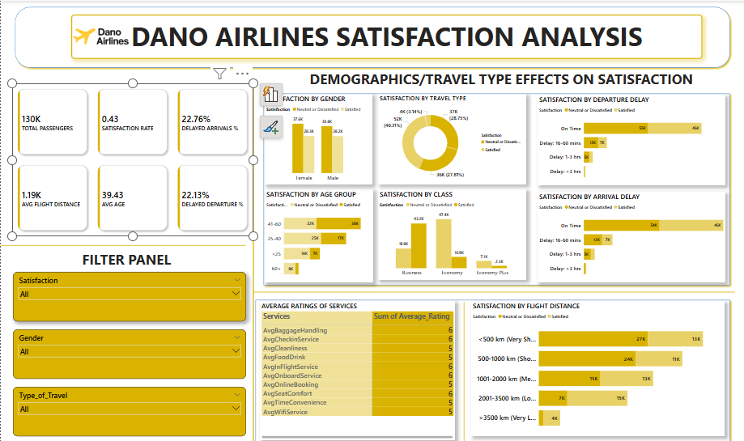

# Dano-Airlines-Satisfaction-Analysis
Data driven analysis of airline passenger satisfaction using SQL Server and Power BI, with insights to help Dano Airlines improve customer experience.
### Project Overview
This project analyzes customer satisfaction data from Dano Airlines, a UK-based airline, using SQL Server for data exploration and Power BI for interactive visualizations.
The goal is to uncover key factors affecting passenger satisfaction such as delays, class of service, and inflight experience and to recommend actionable strategies for improving the airline's overall customer satisfaction rate, which recently dropped below 50%.

---
### Tools Used
SQL Server
  - Data Cleaning
  - Data Querying
    
Power BI
  - Calculated Columns
  - DAX calculations
  - Data Modeling
  - Data Visualization
    
GITHUB
  - Documentation

---
### Dataset Description
 The goal of this project is to analyze customer satisfaction data from over 120,000 passengers and uncover the key drivers influencing satisfaction and dissatisfaction. Based on the findings, strategic recommendations will be made to help Dano Airlines enhance the overall passenger experience and improve their satisfaction score.
 
 The dataset includes responses from passengers and covers variables such as:

- Demographics (e.g., Gender, Age)

- Flight characteristics (e.g., Class, Distance, Delays)

- Service ratings (e.g., Online Booking, In-flight Service, Food & Drink)

- Overall Satisfaction

---
### Key Questions Explored

- How does satisfaction vary by gender, age, class, and type of travel?

- What impact do delays have on passenger satisfaction?

- Which in-flight services are most strongly associated with dissatisfaction?

- What KPIs should Dano Airlines track to monitor improvement?
  
- Service Rating Performance

---
### Dashboard

Here's a visual overview of the Dano Airlines passenger satisfaction dashboard:



---
###SQL Queries
1) ### Satisfaction by Gender
```
SELECT Gender, Satisfaction, COUNT(*) AS Count
FROM Airline_Data
GROUP BY Gender, Satisfaction;
```
2) ### Satisfaction by Age Group
```
SELECT 
  CASE 
    WHEN Age < 20 THEN 'Under 20'
    WHEN Age BETWEEN 20 AND 34 THEN '20–34'
    WHEN Age BETWEEN 35 AND 49 THEN '35–49'
    WHEN Age BETWEEN 50 AND 64 THEN '50–64'
    ELSE '65+' 
  END AS AgeGroup,
  Satisfaction,
  COUNT(*) AS Count
FROM Airline_Data
GROUP BY 
  CASE 
    WHEN Age < 20 THEN 'Under 20'
    WHEN Age BETWEEN 20 AND 34 THEN '20–34'
    WHEN Age BETWEEN 35 AND 49 THEN '35–49'
    WHEN Age BETWEEN 50 AND 64 THEN '50–64'
    ELSE '65+' 
  END,
  Satisfaction;
```

3) ### Satisfactio by Type of Travel
  ```
 SELECT Type_of_Travel, Satisfaction, COUNT(*) AS Count
FROM Airline_Data
GROUP BY Type_of_Travel, Satisfaction;
```

4) ### Satisfaction by Class
```
SELECT Class, Satisfaction, COUNT(*) AS Count
FROM Airline_Data
GROUP BY Class, Satisfaction;
```

5) ### Satisfaction by Flight Distance Category
```
SELECT 
  CASE 
    WHEN Flight_Distance < 500 THEN '<500 km'
    WHEN Flight_Distance BETWEEN 500 AND 1500 THEN '500–1500 km'
    ELSE '>1500 km' 
  END AS DistanceCategory,
  Satisfaction,
  COUNT(*) AS Count
FROM Airline_Data
GROUP BY 
  CASE 
    WHEN Flight_Distance < 500 THEN '<500 km'
    WHEN Flight_Distance BETWEEN 500 AND 1500 THEN '500–1500 km'
    ELSE '>1500 km' 
  END,
  Satisfaction;
```

6) ### Satisfaction by Departure Delay
```
SELECT 
  CASE WHEN Departure_Delay > 15 THEN 'Delayed' ELSE 'On Time' END AS DepartureStatus,
  Satisfaction,
  COUNT(*) AS Count
FROM Airline_Data
GROUP BY 
  CASE WHEN Departure_Delay > 15 THEN 'Delayed' ELSE 'On Time' END,
  Satisfaction;
```
 7) ### Satisfaction by Arrival Delay
 ```
SELECT 
  CASE WHEN Arrival_Delay > 15 THEN 'Delayed' ELSE 'On Time' END AS ArrivalStatus,
  Satisfaction,
  COUNT(*) AS Count
FROM Airline_Data
GROUP BY 
  CASE WHEN Arrival_Delay > 15 THEN 'Delayed' ELSE 'On Time' END,
  Satisfaction;
```

8) ### Average Ratings of Services
```
SELECT 
  CASE WHEN Arrival_Delay > 15 THEN 'Delayed' ELSE 'On Time' END AS ArrivalStatus,
  Satisfaction,
  COUNT(*) AS Count
FROM Airline_Data
GROUP BY 
  CASE WHEN Arrival_Delay > 15 THEN 'Delayed' ELSE 'On Time' END,
  Satisfaction;

---
### Key Business Questions and Insights
1. How does satisfaction vary across Gender, Age, and Class of Travel?
- Gender Insights: 


  


